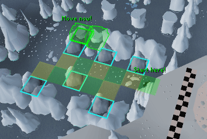
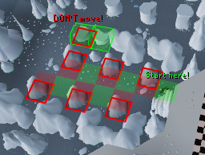
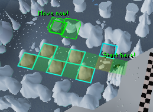
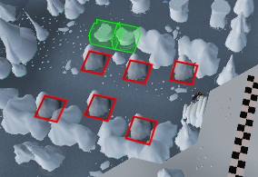

# Penguin Crushers
Clicking on the stepping stone at the end of the penguin agility course crushers obstacle when the crushers have just
finished moving will always allow you to cross without taking damage. However, this can be unintuitive and even when
understood can be difficult to time correctly. The <b>Penguin Crushers</b> plugin helps you identify when the crushers
are moving and when they are still alongside any other information you may need to make your journey through this
obstacle a safe one.

With a less obnoxious configuration:

")

### Screenshots:

